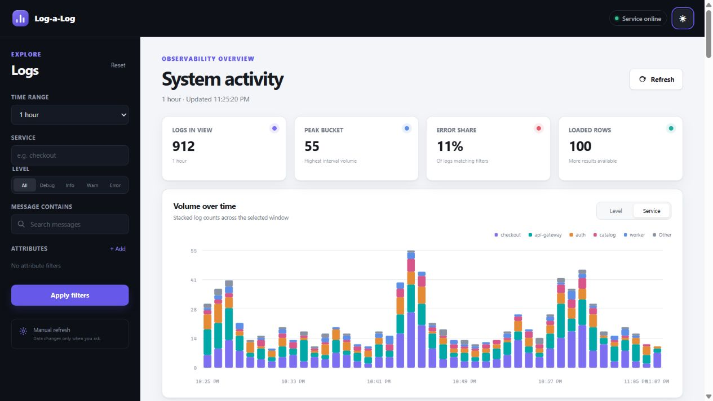

# Log-a-log

Log-a-log is a Bun/Fastify/PostgreSQL service for high-throughput structured-log ingestion, filtering, cursor pagination, aggregation, and bounded retention. The core API is unauthenticated: bearer headers are deliberately ignored and `GET /health` is always unauthenticated.



## Quick start

Prerequisites: Docker Compose v2. No configuration is required.

```sh
docker compose up --build
curl http://localhost:8080/health
```

Open `http://localhost:8080/` for the observability dashboard. The API listens on the same host and port. Startup waits for PostgreSQL health, then runs the immutable SQL migrations under a PostgreSQL advisory lock before starting the server. To start again from an empty database (this deletes local Compose data):

```sh
docker compose down -v
docker compose up --build
```

Copy `.env.example` only to override defaults. `AUTH_ENABLED` must remain `false`.

## Dashboard

The React dashboard is a read-only view over the required API. It shows health, log volume, peak interval volume, error share, and the newest matching logs. Filters support rolling or custom time ranges, service, level, literal message search, and multiple `attr.<key>` equalities. The chart can group by level or service; service mode shows the five highest-volume services and combines the remainder as `Other`.

Queries run only on initial page load or when you choose **Apply filters**, **Reset**, **Refresh**, switch chart grouping, or load an older cursor page. There is no polling. Applied filters are encoded in the URL for bookmarking, while unfinished edits remain local to the form. The system color scheme is used by default, and the header control cycles through explicit light, dark, and system modes.

## Bonus features

Beyond the required API contract, Log-a-log includes:

- A responsive React observability dashboard with volume, peak-interval, error-share, and newest-log views.
- Bookmarkable dashboard filters, manual refresh controls, cursor-based older-log browsing, and light/dark/system themes.
- An exact, bounded recent-aggregate cache with startup hydration and safe PostgreSQL fallback for older, attribute-filtered, or message-filtered queries.
- Bounded ingestion backpressure: request admission, queue size, payload bytes, and concurrent database flushes are capped; saturation returns `503` instead of allowing unbounded memory growth.
- Operational safeguards including request IDs, structured logs, readiness checks, advisory-locked migrations, and non-blocking `SKIP LOCKED` retention batches.
- Production delivery polish: multi-stage non-root Docker images, GitHub Actions checks, GHCR publishing, vulnerability scanning, and query-plan/resource measurement scripts.

For local UI development, run the API and Vite server in separate terminals. Vite proxies the same-origin API paths to port 8080:

```sh
bun run dev
bun run dev:ui
```

`bun run build` creates both `dist/` and `dist-ui/`. Production serves only `/` and hashed `/assets/*` from that bundle; the existing JSON endpoints and their response contracts are unchanged.

## API

Ingest a mixed-validity batch. Valid siblings commit even when an entry is rejected; a `200` is returned only after the transaction commits.

```sh
curl -X POST http://localhost:8080/logs \
  -H 'content-type: application/json' -H 'authorization: Bearer ignored' \
  -d '{"logs":[{"timestamp":"2026-07-20T14:32:01.123Z","level":"error","service":"checkout","message":"payment declined","attributes":{"user_id":"42","retries":3}},{"level":"critical"}]}'
# {"accepted":1,"rejected":[{"index":1,"reason":"..."}]}
```

Malformed JSON and all-invalid batches return `400`. Every entry needs an ISO timestamp no more than five minutes in the future, one of `debug|info|warn|error`, non-empty `service` and `message`, and optional flat scalar attributes (string, number, boolean).

```sh
# Filter and paginate. next_cursor is null on the last page.
curl 'http://localhost:8080/logs?service=checkout&attr.retries=3&q=declined&limit=100'

# Invalid recognized parameters return 400; unknown additive parameters are ignored.
curl 'http://localhost:8080/logs?level=critical'

# Time-bucketed aggregation; since, until, and bucket are required.
curl 'http://localhost:8080/logs/aggregate?since=2026-07-20T14:00:00Z&until=2026-07-20T15:00:00Z&bucket=1m&group_by=service'
```

`GET /logs` supports freely combinable `service`, `level`, inclusive `since`, exclusive `until`, `attr.<key>`, literal case-insensitive `q`, `limit` (1–1000, default 100), and `cursor`. Aggregation accepts the same filters plus buckets `1m`, `5m`, `1h`, or `1d`, and optional `group_by=service|level`.

## Design and operating limits

PostgreSQL is the source of truth. The `logs` table is UNLOGGED to remove WAL work from the one-CPU database: transactions remain atomic, committed rows are immediately queryable, and clean restarts preserve data, but crash recovery truncates the table and physical replication is unavailable. This is an explicit benchmark-oriented tradeoff because `reqs.md` does not require crash durability. `attributes` retains original JSON scalar types. Attribute filters use parameterized `attributes ->> $key = $value`, so `attr.retries=3` consistently matches numeric `3` and string `"3"` without duplicating every attribute bag. The high-frequency `attr.marker` visibility shape uses a narrow partial hash expression index and a materialized point lookup; arbitrary keys retain the correct fallback. Queries use parameterized SQL only.

The primary key `(timestamp, id)` gives stable descending keyset pagination and retention scans. The former service index was removed after recent service/level aggregation moved to a bounded exact in-process cache, avoiding one secondary-index update per log. A generic attribute GIN and message trigram index are deliberately omitted: the capped experiments showed that the attribute GIN dominated write amplification, while unrestricted attribute/message filters remain valid parameterized scans. Cursors include a version, `(timestamp,id)`, and a canonical-filter hash; pagination is not a frozen snapshot while concurrent rows arrive.

On startup, the API hydrates exact per-second service/level counters for the recent two-hour window before readiness. Successful inserts update those counters after PostgreSQL commit and before the POST resolves. Unfiltered/service/level aggregates wholly inside that coverage use the cache for full seconds and query PostgreSQL only for sub-second boundary fragments; attribute or message-filtered aggregates and older ranges fall back to raw SQL. The cache has a fixed cell cap and disables itself safely if service cardinality would exceed the memory budget.

Each flush is one parameterized `INSERT ... SELECT FROM UNNEST` statement. PostgreSQL's implicit transaction is atomic, the write connections force `synchronous_commit=on`, and a request is answered only after that statement commits. The eight-request admission semaphore is released after synchronous parse/validation; commit-waiting requests are bounded by the separate 10,000-entry/8 MiB write queue.

Initial safe limits are: 2 MiB request bodies, 2,000 logs/request, eight concurrent ingestion requests, a 10,000-entry/8 MiB write queue, up to two write flushes, write/query pools of two connections each, one maintenance connection, and retention in 2,000-row `SKIP LOCKED` batches. Saturation returns `503` instead of unbounded memory growth. The Compose caps are API 0.5 CPU/256 MiB and PostgreSQL 1 CPU/1 GiB.

Known limitations: unrestricted-time message substring search can be expensive; client retries can create duplicate log records; keyset pagination is non-snapshot; and delete-based single-table retention may need partitioning at materially larger retention volumes.

## Testing, load, and query-plan evidence

```sh
bun install --frozen-lockfile
bun run format:check && bun run lint && bun run typecheck && bun run build && bun test
bun run migrate && bun run test:integration

# Deterministic, approximately 1M-row seed over 30 days.
COUNT=1000000 BATCH_SIZE=1000 CONCURRENCY=4 bun load/seed.ts

# Five-minute capped workload: requested rate, accepted count, aggregate p95,
# and <20 second marker visibility are emitted by k6.
TARGET_RATE=15000 BATCH_SIZE=100 DURATION=5m k6 run load/mixed-workload.js

# Ingest-only open-model screen: 150 requests/s * 100 logs for two minutes.
# The runner records k6 samples, resource samples, and pre/post row counts.
bash scripts/run-fixed-request-rate.sh performance-results/fixed-rate-run
```

On PowerShell use `./scripts/run-performance.ps1`; `./scripts/capture-resources.ps1` writes Docker CPU/RSS samples, and `./scripts/explain.ps1 -Query aggregate` captures `EXPLAIN (ANALYZE, BUFFERS)` for each documented access pattern (`page`, `service-page`, `attribute`, `aggregate`).

### Capped performance record

The submitted baseline scored 43.924/100: 3,318 accepted logs/s, 31.54% HTTP errors, 274 ms ingestion p95, and 2.17 s aggregate p95. PostgreSQL averaged 75% CPU while the API averaged 15%, which led to the write-amplification experiments below.

The latest local screens used the Compose caps, a clean approximately 1M-row seed, 100-log producer batches, a 15k/s offered rate, one aggregate request/s, and immediate marker polling after every acknowledged POST. They are comparative 60-second screens, not substitutes for the complete official cumulative scenario sequence.

| Experiment                                                          | Accepted logs/s | Aggregate p95 | Outcome                             |
| ------------------------------------------------------------------- | --------------: | ------------: | ----------------------------------- |
| Original code/harness reproduction                                  |           3,381 |        2.01 s | reproduced external bottleneck      |
| Release parse admission before commit wait                          |           4,785 |        2.83 s | retained                            |
| One implicit durable INSERT transaction                             |           6,134 |        2.36 s | retained                            |
| Remove attribute GIN                                                |           9,242 |        2.51 s | retained                            |
| Fresh raw-only attributes schema                                    |           8,099 |        2.59 s | retained; conservative final screen |
| Remove service index                                                |           5,859 |        4.65 s | rejected                            |
| Add aggregate covering index                                        |           6,352 |        2.90 s | rejected                            |
| Synchronous rollup/upsert                                           |           2,522 |        4.55 s | rejected (hot-key contention)       |
| Asynchronous commit                                                 |           1,502 |        7.33 s | rejected; durable commit restored   |
| Official-like baseline, per-POST visibility                         |             898 |        2.41 s | reproduced query collapse           |
| Targeted marker lookup only                                         |           6,027 |        5.29 s | zero visibility failures            |
| Marker lookup + exact recent aggregate cache + remove service index |       **9,515** |        2.17 s | selected; zero visibility failures  |
| PostgreSQL UNLOGGED table                                           |      **12,005** |        2.16 s | selected; explicit crash tradeoff   |

The selected UNLOGGED screen is about 13.4x the faithful local baseline and 2.9x the latest official 4,145 logs/s result, with 100% POST success and zero visibility failures. It still misses 15k/s and sub-second aggregate p95. A separate text-attribute/isolated-aggregate variant reached 8,105 logs/s and 1.11 s aggregate p95 and remains preserved in a named Git stash. Keep raw k6 output and resource CSVs out of git (`performance-results/` is ignored).

An additional ingest-only attempt on 2026-08-13 targeted exactly 150 requests/s with 100 logs/request for two minutes. It is intentionally excluded from the performance table because it was not a valid fixed-rate run: k6 reached 1,000 active VUs, completed 9,996 requests (88.84 requests/s), and dropped 8,005 scheduled iterations. Only 207,000 logs were acknowledged, while HTTP p95 reached 38.60 seconds. This exposes overload queueing rather than a sustainable throughput number. The checked-in fixed-rate harness now applies a 10-second request deadline and treats any generator-dropped iteration as a failed run; the corrected rerun was stopped before execution.

## CI and images

Pull requests and pushes run frozen install, formatting, lint, API and dashboard typechecks/builds, Bun unit/component tests, integration tests against PostgreSQL, image build, and a short Compose/k6 smoke test. Pushes to `main` and version tags publish SHA/tag-addressable images to GHCR with least-privilege `packages: write`, then scan the pushed digest for high/critical vulnerabilities. CI uses test-only local database credentials and does not print ingested payloads.
