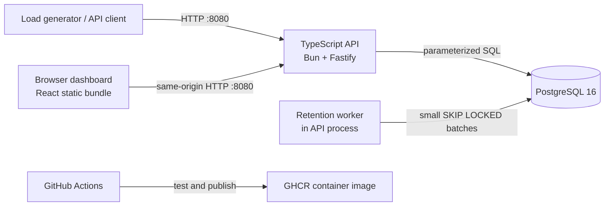

# Log Ingestion & Query Service — Architecture

Status: proposed implementation blueprint  
Scope: required project contract first; the read-only dashboard is the single user-approved stretch feature
Target: sustain at least 15,000 accepted logs/second, keep newly accepted data queryable within 20 seconds, and serve 1 aggregation request/second with aggregate-query p95 below 1 second at approximately 1 million rows while ingestion is active. Sustained 20,000–25,000+ logs/second is a stretch target.

## 1. Goals and constraints

The service must:

- expose the required HTTP contract exactly on container port `8080`;
- partially accept batches: one invalid item must never reject valid siblings;
- preserve attribute value types in responses, while comparing attribute filters as strings;
- sustain at least 15,000 logs/second under the graded CPU and memory limits, with 20,000–25,000+ logs/second as stretch performance;
- make committed logs queryable within 20 seconds and handle 1 aggregation request/second during ingestion with p95 below 1 second at approximately 1 million stored rows;
- keep query latency predictable during concurrent writes and retention;
- use only parameterized SQL and whitelist every identifier-like query choice;
- start completely with `docker compose up`, including migrations;
- provide enough measurements and `EXPLAIN (ANALYZE, BUFFERS)` evidence to defend every index.

The selected design uses one UNLOGGED PostgreSQL source-of-truth table plus a bounded recent aggregate cache in the API process. The write path uses bounded request coalescing: a `200` means the transaction has committed, the row is immediately visible to queries, and recent service/level counters have been updated. UNLOGGED storage preserves atomic transactions and clean-restart data but can be truncated by crash recovery; this explicit benchmark-oriented tradeoff removes WAL work from the single database CPU. The cache removes repeated raw aggregation from PostgreSQL without weakening arbitrary filtered-query correctness.

## 2. System context



There is one stateless API image. It also serves a compiled React dashboard at `/`; the dashboard adds no runtime container and uses only the public same-origin endpoints. It can be replicated later. PostgreSQL is the durable system of record. The retention worker runs in the same image for a simple deployment, but takes a PostgreSQL advisory lock so only one replica performs cleanup.

## 3. Technology choices

| Concern | Choice | Reason |
|---|---|---|
| Runtime | Bun + TypeScript, strict mode | Better throughput per CPU and lower runtime overhead under the 0.5 CPU / 256 MB application cap |
| HTTP | Fastify on Bun | Low overhead, request-size controls, structured logging, custom parse/error hooks |
| Dashboard | React + Vite, compiled static assets | Typed, responsive observability UI without adding a production runtime or changing the core API |
| Database client | `pg` on Bun | Small surface area and explicit parameterized SQL |
| Hot-path validation | TypeBox schema compiled once by AJV | Generated validation code avoids per-entry Zod interpretation while preserving indexed rejection reasons |
| Startup validation | Zod, optional | Configuration runs once, so clarity matters more than hot-path throughput |
| IDs | UUIDv7 generated by the application | Unique, time-friendly values without a database sequence hot spot |
| Database | PostgreSQL 16 | JSONB, trigram indexes, good concurrent MVCC behavior, `date_bin` |
| Migrations | SQL files run by a small migration command | Reviewable DDL; the API never silently changes schema during normal serving |
| Tests | Bun's built-in `bun test` + Docker Compose PostgreSQL | Avoids a separate test runtime while exercising real JSONB, cursor, and query-plan behavior |
| Load tests | k6 | Reproducible mixed ingestion/query workload and p95 output |

Fastify and `pg` run on Bun for the APIs used here; their Bun compatibility is verified by the contract/integration suite. Tests use `bun test` rather than Vitest, including React component tests in a lightweight DOM environment. Integration tests use the Compose database rather than depending on a Testcontainers library whose Docker/runtime integration could vary under Bun. If a Node-oriented auxiliary package fails Bun compatibility testing, prefer a Bun-native or Web-standard substitute; do not add a second production runtime.

### 3.1 Resource budget

The grading limits are part of the architecture, not merely deployment settings:

| Container | CPU | Memory | Consequence |
|---|---:|---:|---|
| API | 0.5 CPU | 256 MB | JSON parsing and per-entry validation are expected to be the first bottleneck; concurrency and body retention must be bounded |
| PostgreSQL | 1 CPU | 1 GB | Avoid excessive connections, indexes, sorts, and maintenance work during ingestion |

Initial limits, to be verified rather than guessed during capped-resource load tests:

- write pool: maximum 2 PostgreSQL connections;
- query pool: maximum 2 PostgreSQL connections, reserving capacity for the required aggregation request rate;
- maintenance pool: exactly 1 connection used only by retention and migration locking;
- maximum request body: 2 MiB;
- maximum batch: 2,000 log entries;
- preferred producer batch: 500–1,000 entries;
- validated-write queue: at most 10,000 entries or 8 MiB of normalized payload, whichever comes first;
- at most 2 flush transactions in flight;
- at most 8 concurrently parsed ingestion requests, with overload rejected before admitting more body/queue work.

Fastify necessarily materializes each bounded JSON body. The service validates entries in one tight loop using a single startup-compiled AJV validator, creates normalized attributes only for accepted entries, and drops references immediately after commit/response. It does not construct a Zod result tree or retain the raw body. The 2 MiB × 8 theoretical input ceiling leaves headroom for parsed objects, normalized attributes, runtime heap, SQL arrays, and responses within 256 MB. Heap/RSS and event-loop delay determine whether these caps must be lowered.

The likely first limit at 15,000 entries/second is application-side JSON decoding, validation, and normalization on 0.5 CPU—not PostgreSQL. Profiling must confirm this. Increasing database connections cannot fix a saturated application CPU and may make the 1 CPU database less predictable.

## 4. Data model

Create the main table (the optional message-index migration enables `pg_trgm` only if load testing selects it):

```sql
CREATE TABLE logs (
    id              uuid        NOT NULL,
    timestamp       timestamptz NOT NULL,
    level           text        NOT NULL
                    CHECK (level IN ('debug', 'info', 'warn', 'error')),
    service         text        NOT NULL CHECK (length(service) > 0),
    message         text        NOT NULL CHECK (length(message) > 0),
    attributes      jsonb       NOT NULL DEFAULT '{}'::jsonb,
    ingested_at     timestamptz NOT NULL DEFAULT clock_timestamp(),
    PRIMARY KEY (timestamp, id),
    CHECK (jsonb_typeof(attributes) = 'object')
);
```

`attributes` contains the original JSON values, so a number remains a number in `GET /logs`. Attribute comparisons use PostgreSQL's text extraction operator with parameterized keys and values:

```sql
attributes ->> $key = $value
```

This resolves an important contract detail: `attr.retries=3` matches both JSON number `3` and JSON string `"3"`, because `->>` extracts either as text. It avoids duplicating every attribute bag and removes the measured generic-GIN write bottleneck while returning original types. Flatness and scalar value types are validated before insert.

The composite primary key supplies a stable total order when timestamps collide. UUIDv7 IDs are globally unique by generation; the composite database key is used because every query and retention pass is time-oriented.

### 4.1 Indexes

```sql
-- Supplied by the primary key; supports keyset ordering and retention range scans.
-- PRIMARY KEY (timestamp, id)

CREATE INDEX logs_attr_marker_hash_idx
    ON logs USING hash ((attributes ->> 'marker'))
    WHERE attributes ? 'marker';

```

Index-to-query mapping:

| Query shape | Expected access path |
|---|---|
| time range / unfiltered page | primary-key B-tree range/backward scan |
| service + time + page | backward primary-key scan plus service filter |
| level + time + page | time range through the primary key, then filter the low-cardinality level |
| `attr.marker` visibility equality | partial marker hash expression index via materialized point lookup |
| other `attr.*` equalities | parameterized JSONB text extraction over the time candidate set |
| case-insensitive message substring | time/service/attribute candidate scan plus literal `ILIKE`; a trigram GIN index is a measured opt-in |
| retention cutoff | leading `timestamp` in the primary key |

The measured implementation has one narrow secondary index for the grader-like read-after-write marker shape. Capped experiments showed that the generic attribute GIN dominated write amplification. Once recent service/level aggregation moved out of PostgreSQL, removing the service index helped the clean official-like mixed screen reach approximately 9.5k accepted logs/s. A dedicated level index is omitted because four-value cardinality makes it weak, and the message trigram GIN remains deferred. Unrestricted `q` and arbitrary attribute queries remain correct but expensive fallback shapes.

### 4.2 Why the baseline is not partitioned

At the required approximately 1 million rows representing about one month, a single table gives simpler correctness and lower planning overhead. Daily partitions would make bulk expiry cheap, but introduce partition-creation and late-log routing complexity—the API is required to accept arbitrarily old, valid timestamps. Retention therefore uses short MVCC deletes in the baseline. Range partitioning is the first scaling step if measured retention I/O or table size, rather than the 15,000 logs/second grading workload, demands it.

## 5. API behavior

All response bodies use `application/json`. Error text may be human-readable, but status codes and required response shapes are fixed.

### Authorization-header compatibility

The shared load generator sends `Authorization: Bearer <key>` to `POST /logs`, `GET /logs`, and `GET /logs/aggregate`. The core service implements no authentication: it ignores any recognized or unrecognized `Authorization` header and never rejects a core request because of that header. `GET /health` is always unauthenticated. Authentication could be added only as an opt-in feature whose disabled default preserves this behavior.

### 5.1 `GET /health`

Readiness becomes true only after configuration validation, migrations, and a successful database probe. The endpoint returns `200 {"status":"ok"}` when ready and `503 {"status":"starting"}` otherwise. Liveness is handled by process/container status; readiness must never claim the service can accept logs before the schema exists.

### 5.2 `POST /logs`

1. The JSON parser handles malformed input and returns `400` with `{ "error": "malformed JSON" }`; there is no entry index to report when the body cannot be parsed.
2. The top-level value must be an object containing a `logs` array.
3. Validate each array item independently with one startup-compiled AJV function and retain its original zero-based index. Translate AJV's compact error codes/paths into deterministic human-readable reasons; do not allocate a Zod parse tree per entry.
4. Parse timestamps strictly as ISO 8601 instants. Reject invalid values and instants more than five minutes ahead of the server's current time. Past timestamps remain valid.
5. Validate level, non-empty service/message, and a flat scalar attribute object.
6. Serialize the validated raw attribute object once, generate UUIDv7 IDs, and submit accepted entries to the bounded write batcher.
7. Return `200` with `{ accepted, rejected }` only after the transaction containing that request's accepted rows commits durably. Return `400` with the same shape if none are valid.

The database statement uses typed parameter arrays with `UNNEST`, not interpolated value lists, so statement text remains constant, the protocol uses only a small fixed number of parameters, and values remain parameterized. Requests with at least 500 accepted entries flush immediately. Smaller requests are coalesced until 1,000 entries, 1 MiB of normalized payload, or 10 ms—whichever comes first. Each flush is one atomic implicit PostgreSQL transaction containing no more than 2,000 rows. At most two flush transactions run concurrently.

Coalescing is an in-memory scheduling optimization, not asynchronous acceptance. Every coalesced request waits for its implicit transaction to commit, and write connections force `synchronous_commit=on`. The parsing semaphore is released immediately after synchronous validation; the separate entry/byte queue bounds requests waiting for commit. A failed coalesced transaction returns `503` to every included request and accepts none of their rows. Because accepted rows go directly to the query table and responses follow commit, normal query visibility is immediate and comfortably inside 20 seconds.

`COPY FROM STDIN` is a benchmark candidate, not the baseline. It can reduce PostgreSQL protocol/statement overhead for large batches, but validation, original request-to-response mapping, transaction boundaries, and durable response timing remain identical. The Bun baseline avoids depending on Node stream behavior in `pg-copy-streams`; enable a COPY implementation only after a Bun compatibility test and a capped-resource profile show the database protocol—not JSON validation—to be the bottleneck. Retain `UNNEST` if COPY does not produce a material throughput gain.

A database failure returns `503` and accepts nothing from the affected transaction; the service never reports acceptance before commit.

Limits are operational safeguards derived from Section 3.1: maximum request body 2 MiB, maximum 2,000 entries per request, service/message/key length limits, a bounded attributes byte size, and bounded parser/write admission. Plain contract-sized generator batches must fit these limits; oversized input returns a clear `400`/`413`, and saturation returns `503`, never process exhaustion.

### 5.3 `GET /logs`

A query-parser module, separate from the handler and SQL builder, validates:

- `service` as an exact string;
- `level` against the four allowed values;
- `since` and `until` as timestamps, enforcing `until >= since`;
- `limit` as an integer from 1 through 1,000, defaulting to 100;
- every `attr.<key>` as a string equality;
- `cursor` as a valid opaque cursor;
- `q` as a literal case-insensitive substring, not a SQL wildcard expression.

Unknown non-attribute query parameters are ignored (and may be counted in diagnostics), so additive generator parameters never break the core service. Repeated recognized scalar parameters return `400`; multiple distinct `attr.*` filters are combined with AND.

The SQL builder includes only supplied predicates and numbers placeholders sequentially. Each attribute filter binds both its key and value:

```sql
attributes ->> $key = $value
```

For `q`, `%`, `_`, and `\` are escaped before using `ILIKE ... ESCAPE '\'`, preserving literal substring semantics while retaining trigram-index support.

Rows are ordered by:

```sql
ORDER BY timestamp DESC, id DESC
```

The database fetches `limit + 1` rows. The extra row determines whether `next_cursor` is non-null and is not returned.

### 5.4 Cursor design

Use keyset pagination, never `OFFSET`. The cursor is base64url-encoded versioned JSON containing:

```json
{"v":1,"ts":"2026-07-20T14:32:01.123Z","id":"<uuid>","filter":"<sha256>"}
```

The next page adds:

```sql
AND (timestamp, id) < ($cursor_timestamp, $cursor_id)
```

`filter` is a hash of the canonicalized supplied filters and endpoint identity, excluding cursor and limit. It prevents accidentally applying a cursor to a different query. Bad decoding, schema, UUID, timestamp, version, or filter hash returns `400`. Base64 is opacity, not authentication; if the service is exposed to untrusted tenants, add an HMAC without changing the API contract.

Keyset pagination prevents skipped/duplicated older rows while concurrent inserts occur. It does not provide a frozen snapshot: newly inserted rows newer than the first page are seen only by starting a new pagination session. This is intentional and documented.

### 5.5 `GET /logs/aggregate`

This endpoint reuses exactly the same recognized-filter parser and predicate builder, and likewise ignores unknown parameters, but:

- requires `since`, `until`, and `bucket`;
- permits only `1m`, `5m`, `1h`, or `1d`;
- permits `group_by` only as `service` or `level`;
- does not accept `cursor` or `limit`.

Bucket interval and group column are selected from hard-coded maps. They are never copied directly from user input into SQL. PostgreSQL uses `date_bin(interval, timestamp, '1970-01-01T00:00:00Z')`; this gives stable UTC-aligned buckets, including five-minute buckets. The selected group expression is either `service`, `level`, or `NULL`. Results order by bucket ascending and then group ascending for deterministic output. Empty buckets are omitted, as allowed.

`COUNT(*)` is returned by `pg` as an int64 string by default. The response mapper converts it to a JavaScript number only after checking it is at most `Number.MAX_SAFE_INTEGER`, so the JSON contract contains a number without silent precision loss.

The selected implementation accelerates the dominant recent aggregate family with exact in-process counters keyed by epoch second, service, and level. Startup hydrates the last two hours before readiness. Each successful write updates the cache only after its database transaction commits and before request promises resolve. Requests without `q` or attribute filters that lie wholly inside verified coverage sum full seconds from memory; at most two sub-second boundary fragments are queried from PostgreSQL and merged. Older, attribute-filtered, and message-filtered aggregates use the raw parameterized SQL path. A one-million-cell cap bounds memory; exceeding it disables the cache and safely restores the raw fallback.

## 6. Retention

Configuration:

- `RETENTION_DAYS` — positive number, default `30`;
- `RETENTION_INTERVAL_MS` — worker wake interval, default one minute;
- `RETENTION_BATCH_SIZE` — rows per transaction, default `2,000` under the 1 CPU database cap.

One worker acquires a fixed advisory lock with `pg_try_advisory_lock`. If it loses its connection, PostgreSQL releases the lock automatically. Each pass repeatedly executes a small transaction equivalent to:

```sql
WITH expired AS (
    SELECT timestamp, id
    FROM logs
    WHERE timestamp < $1
    ORDER BY timestamp, id
    LIMIT $2
    FOR UPDATE SKIP LOCKED
)
DELETE FROM logs l
USING expired e
WHERE l.timestamp = e.timestamp AND l.id = e.id;
```

The cutoff is computed once per pass as `now - retention window`. Each batch commits independently and yields before the next batch. It holds row locks only on expired rows; current inserts do not wait for the job, and queries retain their normal MVCC snapshot. `lock_timeout` and `statement_timeout` keep cleanup from competing indefinitely. Failures are logged and retried on the next interval without affecting API readiness.

Autovacuum must reclaim deleted tuples, so the table receives lower per-table thresholds (for example `autovacuum_vacuum_scale_factor = 0.02` and `autovacuum_analyze_scale_factor = 0.01`) after load-test tuning. Manual `VACUUM FULL` is forbidden in normal operation because it takes an exclusive table lock.

## 7. Concurrency, backpressure, and failures

- Use separate bounded pools: 2 write connections, 2 query connections, and 1 maintenance connection as defined in Section 3.1. This reserves aggregation capacity and prevents retention from consuming request capacity.
- Set PostgreSQL `statement_timeout` for API requests and a short connection-acquisition timeout.
- Bound Fastify request-body parsing, AJV work, the normalized-write queue, and concurrent database flushes. When admission capacity is exhausted, return `503` rather than queueing unbounded memory.
- Keep PostgreSQL `synchronous_commit=on`: accepted responses represent durable commits. Throughput comes from producer batches, bounded cross-request coalescing, and PostgreSQL group commit—not weakened durability.
- On shutdown, stop accepting new connections, allow in-flight requests a bounded drain period, stop the retention loop, then close pools.
- Do not automatically retry ambiguous writes after a lost connection: without a client idempotency key, that can duplicate logs. Document at-least-once client retry behavior and consider an optional idempotency extension later.
- All application errors carry a request ID in logs, but internal SQL/configuration details are not exposed in API responses.

## 8. Suggested project structure

```text
.
├── src/
│   ├── app.ts                    # Fastify-on-Bun construction and hooks
│   ├── server.ts                 # startup, readiness, shutdown
│   ├── config.ts                 # validated environment variables
│   ├── db/
│   │   ├── pool.ts
│   │   ├── migrate.ts
│   │   └── migrations/
│   ├── logs/
│   │   ├── routes.ts
│   │   ├── ingest-schema.ts
│   │   ├── write-batcher.ts
│   │   ├── query-params.ts
│   │   ├── query-builder.ts
│   │   ├── repository.ts
│   │   ├── cursor.ts
│   │   └── types.ts
│   └── retention/worker.ts
├── test/
│   ├── unit/
│   ├── integration/
│   └── contract/
├── load/k6.js
├── scripts/explain.sql
├── Dockerfile
├── docker-compose.yml
├── .github/workflows/ci.yml
├── .github/workflows/publish.yml
├── arch.md
└── README.md
```

HTTP handlers translate HTTP input/output only. Validation, query construction, cursor logic, and database access remain independently testable.

The `web/` application owns browser-only state, runtime response guards, URL serialization, bucket selection, chart shaping, and responsive presentation. It calls only `GET /health`, `GET /logs`, and `GET /logs/aggregate`. Dashboard requests are manual after the initial load; there is no timer-driven polling. Fastify serves `/` without cache and Vite-hashed `/assets/*` with immutable cache headers. No SPA catch-all is registered, so API routing stays explicit.

## 9. Docker and startup

`docker-compose.yml` defines PostgreSQL with a named volume and the API exposed as `8080:8080`. It applies the graded limits—0.5 CPU / 256 MB to the API and 1 CPU / 1 GB to PostgreSQL—in the local performance profile. PostgreSQL has a real health check. The API waits for database health, runs migrations under a PostgreSQL advisory lock, then starts listening and marks readiness true. Migrations are idempotently recorded in a `schema_migrations` table, but individual migration files are immutable after merge.

The Dockerfile is multi-stage and based on a pinned official `oven/bun` image. It runs `bun install --frozen-lockfile`, builds the Bun API and Vite dashboard, copies only the built application, compiled UI, production dependencies, and migrations into the runtime stage, and runs as the image's non-root Bun user. Production startup fails if the UI bundle is incomplete. No Node.js runtime is installed in the production image.

## 10. CI/CD

Pull requests and pushes run:

1. install Bun and run `bun install --frozen-lockfile`;
2. formatting check, ESLint, API/dashboard typechecks, and both production builds;
3. API unit tests and React component tests with `bun test`;
4. integration and API-contract tests against PostgreSQL 16;
5. production image build;
6. a short k6 contract smoke test through Docker Compose with `AUTH_ENABLED=false`.

Authentication is not an implemented optional feature, so `AUTH_ENABLED` defaults to `false` and `AUTH_ENABLED=false` is the only applicable CI configuration. Plain `docker compose up` with no environment configuration starts the exact unauthenticated core service, ignores the generator's bearer header, and requires no project-specific setup.

On merge to `main` and version tags, a separate least-privilege workflow builds the same Dockerfile, scans the image, and publishes immutable SHA and version tags to GitHub Container Registry. Deployment to a specific host is not invented until a target environment is chosen; image publication is the delivery boundary for this project.

## 11. Test and performance plan

Correctness tests cover malformed JSON, missing/non-array batches, mixed valid and invalid entries, the five-minute boundary, all attribute scalar types, nested attributes, Unicode, duplicate timestamps, all freely combinable filters, ignored unknown parameters, ignored bearer headers, literal `%`/`_` searches, invalid/reused cursors, limit boundaries, time inclusivity (`since <= timestamp < until`), every bucket size/group, empty ranges, and retention concurrency.

All performance tests run with the Compose resource limits actually enforced: API at 0.5 CPU / 256 MB and PostgreSQL at 1 CPU / 1 GB. An uncapped developer-machine result is diagnostic only and must not be reported as the graded result.

Prepare approximately 1,000,000 stored rows whose timestamps are spread across roughly one month, with realistic skew across services and levels plus several attribute keys and representative message text. Then run:

1. a warm-up that is excluded from measurements;
2. sustained ingestion at 15,000 logs/second using explicit producer batch sizes, with zero dropped successful responses or process crashes;
3. throughout that ingestion phase, exactly 1 representative aggregation request/second over the approximately one-month data distribution, requiring p95 below 1 second;
4. periodic visibility probes that place a unique marker in an accepted log, poll through the public query API, and fail if it is not observable within 20 seconds;
5. stepped stretch trials at 20,000 and 25,000 logs/second, clearly separated from the 15,000/s pass/fail baseline;
6. cold-ish-cache and warm-cache query-plan captures, plus a retention-overlap trial.

Use a long enough steady-state window to expose queue growth, garbage collection, WAL/checkpoint effects, and thermal throttling; five minutes is the initial minimum. Track database row count during the run and report latency bands near 1 million rows separately if continued ingestion grows materially beyond the grading size. The accepted-entry rate—not merely HTTP request rate—is the throughput metric.

The README performance table reports: producer and database flush batch sizes, attempted and accepted logs/second, HTTP request rate, aggregation rate, error rate, ingestion and aggregate p50/p95/p99 latency, worst and p95 visibility delay, API CPU/RSS/event-loop delay, PostgreSQL CPU/RSS/connections, database/WAL size, queue depth, and pool wait time. It also names the first bottleneck found and lists each optimization applied with before/after numbers. Capture `EXPLAIN (ANALYZE, BUFFERS, WAL)` for ingestion and `EXPLAIN (ANALYZE, BUFFERS)` for representative aggregate and paginated query shapes.

The performance claim is accepted only from capped, measured results. If throughput misses 15,000/s, profile Bun JSON parse, AJV, attribute normalization, batch assembly, and commit/WAL time in that order. If aggregate p95 misses one second, inspect actual plans before adding an index or rollup. A growing in-memory queue is a failed throughput test even if the short-window accepted rate appears sufficient.

## 12. Observability

Structured JSON logs include request ID, route, status, latency, accepted/rejected counts, database error class, retention rows/batch duration, and cursor-safe query shape—never full messages or arbitrary attribute values by default. A lightweight optional `/metrics` endpoint can expose request histograms, pool saturation, ingestion counts, query latency, and retention lag, but it must not delay the required endpoints.

## 13. Requirement traceability

| Requirement | Architecture response |
|---|---|
| exact API and port | Sections 5 and 9 |
| per-entry batch validation | Section 5.2 |
| combinable filters | Sections 5.3 and 5.5 |
| cursor pagination | Section 5.4 |
| time-bucket aggregation | Section 5.5 |
| arbitrary attributes | raw JSONB plus parameterized text extraction in Section 4 |
| non-blocking retention | small `SKIP LOCKED` transactions in Section 6 |
| deliberate, explainable indexes | Section 4.1 and performance plan |
| at least 15,000 logs/second; 20,000–25,000+ stretch | Sections 1, 3.1, 5.2, and 11; final proof must be measured under caps |
| 1 aggregation request/second, p95 < 1 second at ~1M rows | Sections 1, 5.5, and 11 |
| accepted logs queryable within 20 seconds | durable direct-table write in Section 5.2 and visibility probes in Section 11 |
| API 0.5 CPU / 256 MB; PostgreSQL 1 CPU / 1 GB | Sections 3.1, 7, 9, and 11 |
| generator bearer header does not enable auth | Authorization-header compatibility in Section 5 and CI configuration in Section 10 |
| Docker Compose | Section 9 |
| GitHub Actions CI/CD | Section 10 |
| README design/performance evidence | Section 11 |

## 14. Decisions to revisit after the first load test

1. **Single table versus daily range partitions.** Stay single-table at approximately 1 million rows; partition only if capped retention/vacuum measurements cause ingestion below 15,000/s or aggregation p95 above one second.
2. **Attribute storage and GIN cost.** Measurement selected one raw `attributes` JSONB column plus parameterized `->>` comparisons. Migration `002` removes the duplicate normalized column and generic attribute GIN after the capped screen improved from roughly 6.1k to 9.2k accepted logs/s without it. Reconsider targeted expression indexes only for measured frequent keys.
3. **Deferred message trigram GIN.** Run the required `q` workload first without it. Add `pg_trgm` plus `GIN (message gin_trgm_ops)` only if `q` aggregation p95 exceeds one second and the added index still permits at least 15,000 inserts/second within database CPU/WAL limits. Trigram searches shorter than three characters are tested separately because they may not benefit.
4. **B-tree indexes.** Retain `logs_service_page_idx` only if its query benefit exceeds its measured write/WAL cost. Add a level or combined `(service, level, timestamp, id)` index only when `EXPLAIN` and capped p95 results show a frequent query needs it; level's four-value cardinality alone is not enough justification.
5. **UNNEST versus COPY and batch thresholds.** Start with typed-array `UNNEST`. Adopt COPY only after Bun compatibility is proven and it materially increases capped accepted-entry throughput without changing durable per-request semantics. Tune 500/1,000/2,000 entry and 10 ms thresholds from queue, latency, CPU, and WAL measurements; never hide insufficient throughput behind a growing queue.
6. **Rollups.** Do not pre-aggregate initially because arbitrary message and attribute filters cannot generally use a simple rollup. Add targeted rollups only for measured, well-defined query families and only if their maintenance cost preserves 15,000/s ingestion.
7. **Deployment target.** GHCR publication satisfies delivery; actual CD requires choosing a host/platform and its secret/rollback model.
